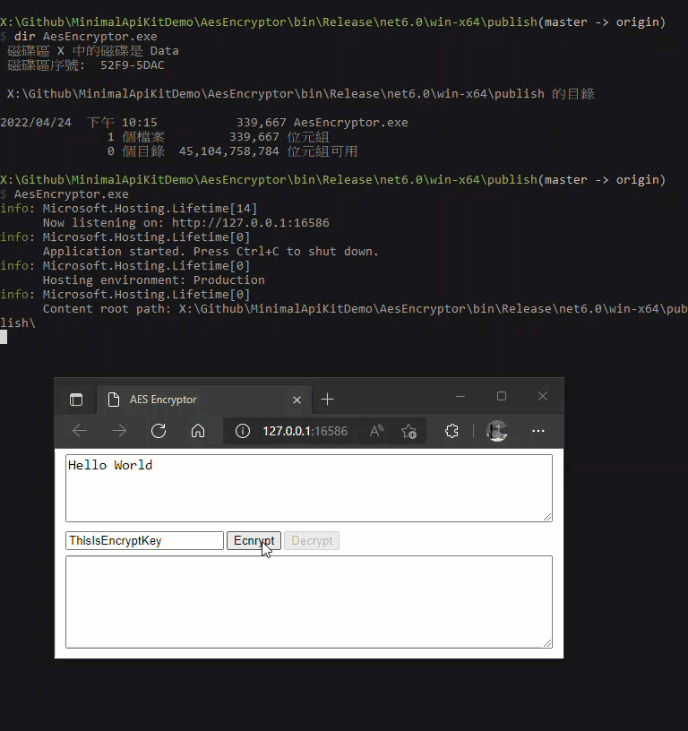

# Drk.AspNetCore.MinimalApiKit

Convert your ASP.NET Core to desktop application in a few steps. 

## Lauching and closing browser autmatically

1. Create a ASP.NET Core Minimal API project.
2. `dotnet add package Drk.AspNetCore.MinimalApiKit` to add reference.
3. Add `<script src="/sse.js"></script>` in your web page HTML.
4. In Program.cs, use Drk.AspNetCore.MinimalApiKit namespace and change `app.Run()` to `app.RunAsDesktopTool()`.

The default browser will launch as soon as the application start and navigate to its home webpage.  After closing all browser window/tab of the web, the application will exit automatically soon.



You can find the example project in `src/RunAsDesktopToolDemo` folder.

程式說明：[Electron.NET 太笨重？用 ASP.NET Core Minimal API 寫桌面小工具的快速做法](https://blog.darkthread.net/blog/electron-net-alternative/)

## Running with notify icon

1. Create a ASP.NET Core Minimal API project.
2. Change OutputType and TargetFramework to WinExe and net6.0-windows/net7.0-windows, add UseWindowsFroms true if you want to use Windows Form control or MessageBox:  
    ```xml
    <PropertyGroup>
        <OutputType>WinExe</OutputType>
        <TargetFramework>net6.0-windows</TargetFramework>
        <UseWindowsForms>true</UseWindowsForms>
    </PropertyGroup>
    ```
3. `dotnet add package Drk.AspNetCore.MinimalApiKit` to add reference.
4. In Program.cs, use Drk.AspNetCore.MinimalApiKit namespace and change `app.Run()` to `app.RunWithNotifyIcon(new NotifyIconOptions {...})`.    The NotifyIconOptions argument is required to define notify icon image, tooltip and context menu items.  
   Example:  
    ```cs
    app.RunWithNotifyIcon(new NotifyIconOptions
    {
        IconStream = typeof(Program).Assembly.GetManifestResourceStream($"AsNotifyIconDemo.App.ico"),
        ToolTip = "NotifyIcon ToolTip",
        MenuItems =
        {
            NotifyIconOptions.CreateLaunchBrowserMenuItem("Launch Browser", (webBaseUrl) => webBaseUrl),
            NotifyIconOptions.CreateMenuSeparator(),
            NotifyIconOptions.CreateActionMenuItem("Say Hello", (state) =>
            {
                System.Windows.Forms.MessageBox.Show("Hello, World!");
            })
        }
    });
    ```

[Demo video on YouTube](https://www.youtube.com/watch?v=qfKrwCcLGAs)

You can find the example project in `src/RunWithNotifyIconDemo` folder.

程式說明：[把 ASP.NET Core 變成 Windows 桌面常駐程式](https://blog.darkthread.net/blog/min-api-run-with-tray-icon/)